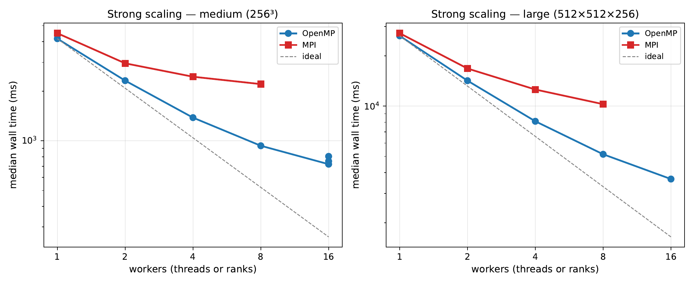
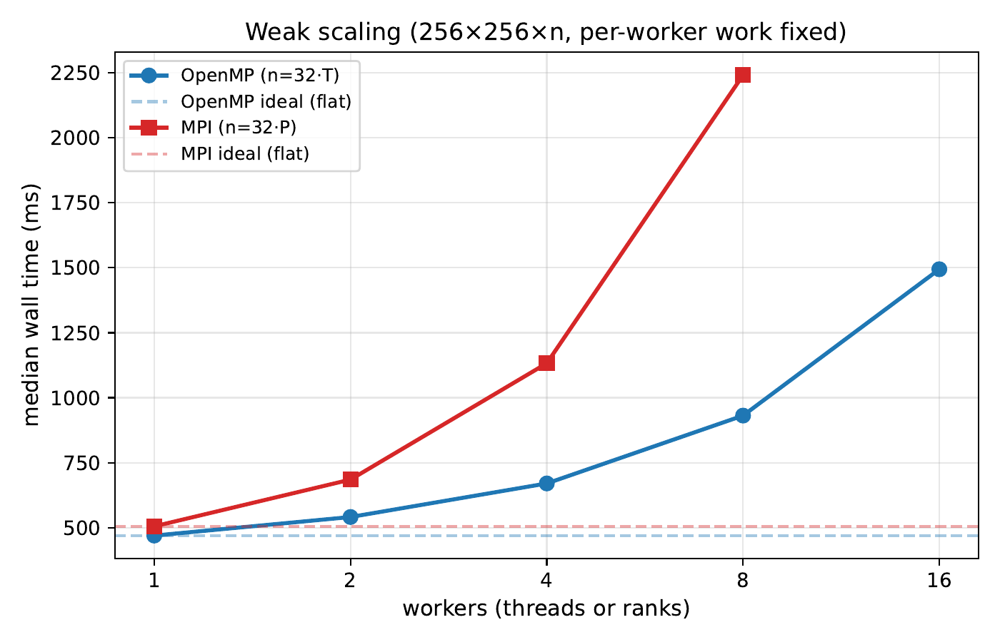

# Parallel t-SVDM: serial C++/LAPACK, OpenMP, MPI, CuPy (GPU), and Julia

Five implementations of the full t-SVDM (tensor SVD with M-product;
Kilmer, Horesh, Avron & Newman, *PNAS* 2021) benchmarked across CPU,
distributed-memory, and GPU. The algorithm has structure that maps
cleanly onto every HPC paradigm covered in CS 2050: the dominant cost
is `n` independent matrix SVDs (embarrassingly parallel at the slice
level), and the surrounding mode-3 transforms reduce to single dense
matrix-matrix products. See `report/report.pdf` for the full
discussion.

## Results

Wall-clock on the `large` 512×512×256 fixture (`median_ms` from
`report/results.csv`). The serial C++/LAPACK backend was not run at
this size, so the single-thread OpenMP run is the baseline; every
speedup is relative to it.

| Backend | Workers | Time | Speedup vs baseline |
|---|---|---|---|
| Serial C++ / LAPACK | 1 (openmp, 1 thread) | 26.3 s | 1.0× |
| OpenMP | 16 threads | 3.66 s | 7.2× |
| MPI | 8 ranks | 10.3 s | 2.6× |
| CuPy (single GPU) | 1 | 22.3 s | 1.2× |
| Julia (stdlib) | 1 | 30.9 s | 0.85× |

All backends reconstruct the input to ~1e-15 relative Frobenius error
and are cross-validated against the Python reference in
`cuda/tsvdm_core.py`, itself oracle-tested against the `mprod` package.
Weak-scaling curves and VTune hotspot analysis are in
`report/report.pdf`.




## Directory tour

```
HPC_Project/
├── README.md                     ← you are here
├── .gitignore                    Keeps venvs, traces, .pyc, etc. out of git
│
├── serial/        Part 1   C++ + LAPACK (single thread, baseline); fixture-gen Slurm script
├── openmp/        Part 2   C++ + LAPACK + OpenMP pragmas
├── mpi/           Part 3   C++ + LAPACK + MPI across nodes
├── cuda/          Part 4   Python + CuPy (cuBLAS / cuSOLVER); also Part 0 NumPy reference + cross-impl validator
├── additional/    Part 5   Julia (stdlib only)
│
└── report/        Part 6   report.tex / report.pdf + figures + parsing/plotting scripts
```

Each implementation directory has its own `README.md` with build /
run instructions and a `results/` subdirectory containing both the
per-Slurm-job stdout and the per-implementation scaling plot. The
`cuda/` directory doubles as the Part 0 Python reference oracle —
`cuda/tsvdm_core.py` is what the C++/Julia/CuPy results are
cross-validated against (itself oracle-tested against
`mprod_package` via `cuda/tests/test_oracle.py`).

## Quick reproduce — full submission sequence on the cluster

Assumes the repo is at `~/HPC_Project` on the cluster (`git clone`
or `rsync` from a laptop).

```bash
# 1. One-time fixture generation (~2 min job).
[cluster]$ cd ~/HPC_Project
[cluster]$ sbatch serial/gen_fixtures.slurm

# 2. The five benchmark jobs (each ≤ 10 min wall, mostly concurrent).
[cluster]$ cd serial      && sbatch submit.slurm                      && cd ..
[cluster]$ cd openmp      && sbatch submit.slurm                      && cd ..
[cluster]$ cd mpi         && sbatch submit.slurm                      && cd ..
[cluster]$ cd cuda        && sbatch submit.slurm                      && cd ..
[cluster]$ cd additional  && sbatch submit.slurm                      && cd ..

# 3. Profiler run (CPU, VTune; one job).
[cluster]$ cd openmp && sbatch profile.slurm && cd ..

# 4. (Optional) weak-scaling jobs for OpenMP and MPI.
[cluster]$ cd openmp && sbatch weak.slurm && cd ..
[cluster]$ cd mpi    && sbatch weak.slurm && cd ..

# 5. Watch progress.
[cluster]$ squeue -u $USER
```

Output lands in each impl's `results/*.out`. After all jobs finish:

```bash
# 6. Pull results back (laptop side).
[local]$ rsync -avz --include='*/' --include='*.out' --include='*.csv' \
                    --include='*.txt' --exclude='*' \
              cluster:~/HPC_Project/  ./HPC_Project/

# 7. Parse + plot locally.
[local]$ python report/parse_results.py
[local]$ python report/plot_scaling.py
[local]$ python report/plot_vtune.py    # after VTune lands

# 8. Compile the report.
[local]$ cd report
[local]$ pdflatex report.tex && bibtex report && pdflatex report.tex && pdflatex report.tex
```

`report/parse_results.py` consolidates every `*/results/*.out` into
`report/results.csv` (one row per (impl, fixture, workers) tuple).
`report/plot_scaling.py` reads that CSV and emits the cross-impl
plots in `report/figures/` plus the per-impl plots in each impl's
`results/` directory.

## Validation

Every backend reports the relative Frobenius reconstruction error
on its output line:

```
m=256 p=256 n=256 reps=30 rel_err=3.585e-15 median_ms=4269.736 ...
```

All five backends agree to within FP64 round-off
(`rel_err ≈ 3 × 10⁻¹⁵`) on the same fixture. The Python reference
in `cuda/tsvdm_core.py` is cross-validated against `mprod_package`
via `cuda/tests/test_oracle.py`:

```bash
[local]$ cd cuda && pip install -r requirements.txt
[local]$ python -m pytest tests -v
```

## Toolchain (cluster)

- **CPU** (`serial`, `openmp`, `mpi`, `additional`): GCC 11.5 +
  Spack OpenBLAS + Open MPI 4.1.7, all in the `CS-2050` Spack env.
  Julia ships with the same env.
- **GPU** (`cuda`): NVIDIA L4 / A10G heterogeneous pool, CUDA 12.x
  driver, in the `CS-2050-gpu` Spack env. CuPy 13.6.0 is installed
  on first run into `cuda/.venv/` (the env doesn't ship CuPy
  natively; the slurm script handles install).

## Layout convention

A is shape `(m, p, n)`. The C++/MPI/Julia code uses Fortran
column-major (frontal slice = contiguous `m × p` block, suitable
for direct LAPACK calls). CuPy uses NumPy/CuPy's C-order with the
leading axis as the slice axis; the same `(A, M)` fixtures work in
both layouts because `cuda/gen_fixture.py` writes the C++ layout
on disk and `cuda/run_cupy.py` reshapes on load.

## Documentation map

- `report/report.pdf` — the deliverable report.
- Per-impl `README.md` files (`serial/`, `openmp/`, `mpi/`, `cuda/`,
  `additional/`) — build/run instructions for each backend.

## Context

Final project for CS 2050 (High-Performance Computing for Science and
Engineering), Harvard, Spring 2026.
